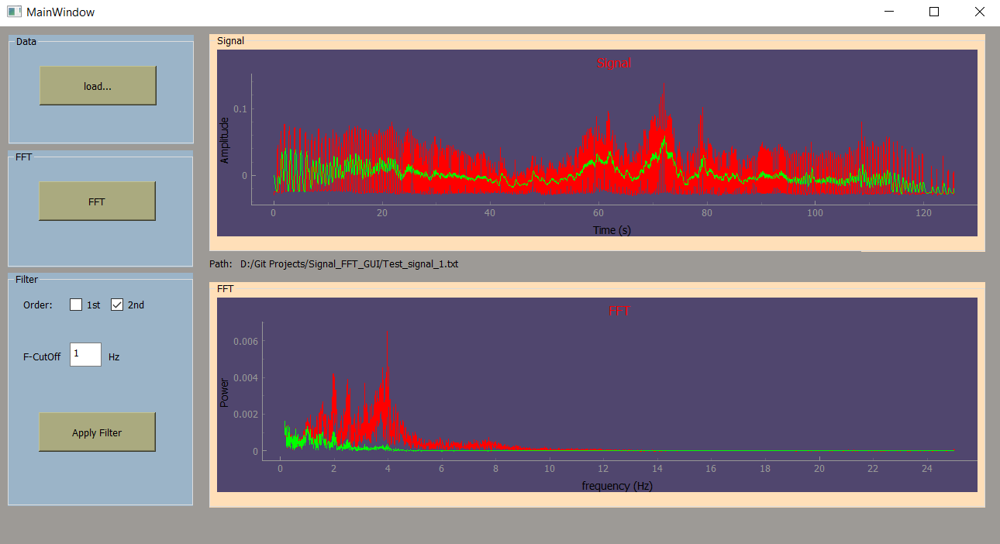

# Signal_FFT_GUI
A Python GUI generated with PyQt5 Designer to calculate and show the FFT of time series (separated by a tabulator {\t}. 
A low pass filter can also be applied on the series. An input field allows the user to input the value of the cutoff frequency of the filter.

# Start the GUI
- Download the code
- Double click on the main.py to start the GUI. 

# Load data
- With the load botton you can load the time series. 
- Select the file and click open (or double click the file) and it will be loaded automatically.
Two test files with two different time series are included.

# FFT
- With the FFT botton you can show the FFT of the time series

# Low Pass filter
- User can select either first "1st" or second "2nd" order filter 
- User can also input the cut-off frequenies of the filters 
- With the " Apply Filter " botton, the Graphs will be updated showing new filtered signal and its FFT in different color

